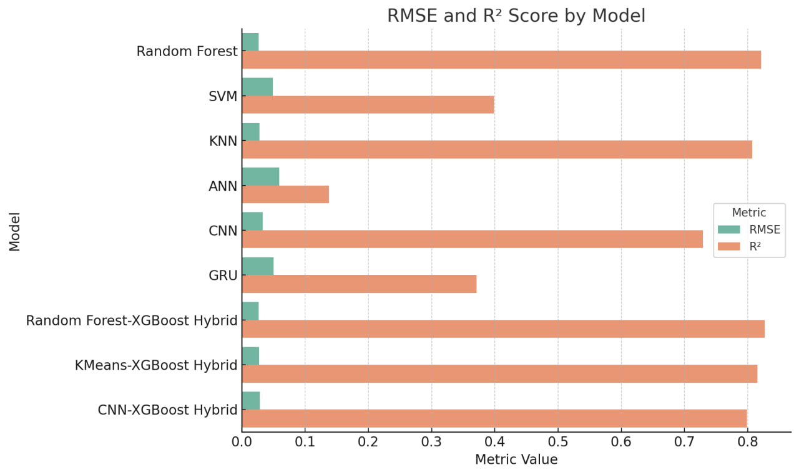
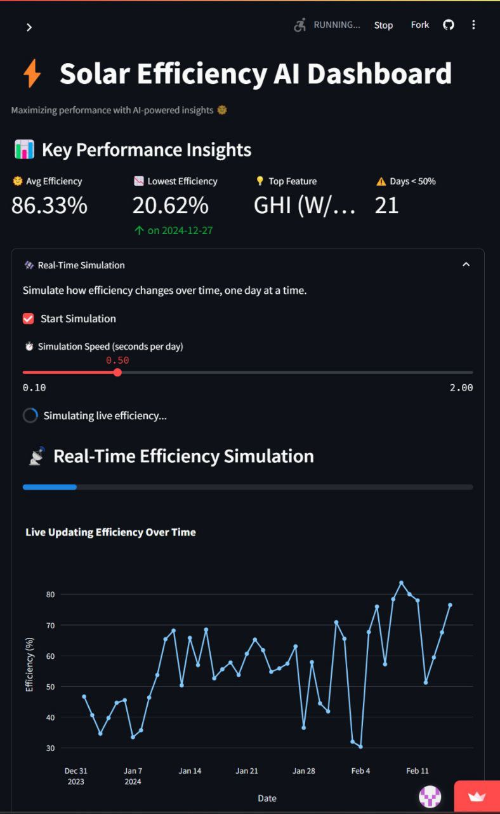
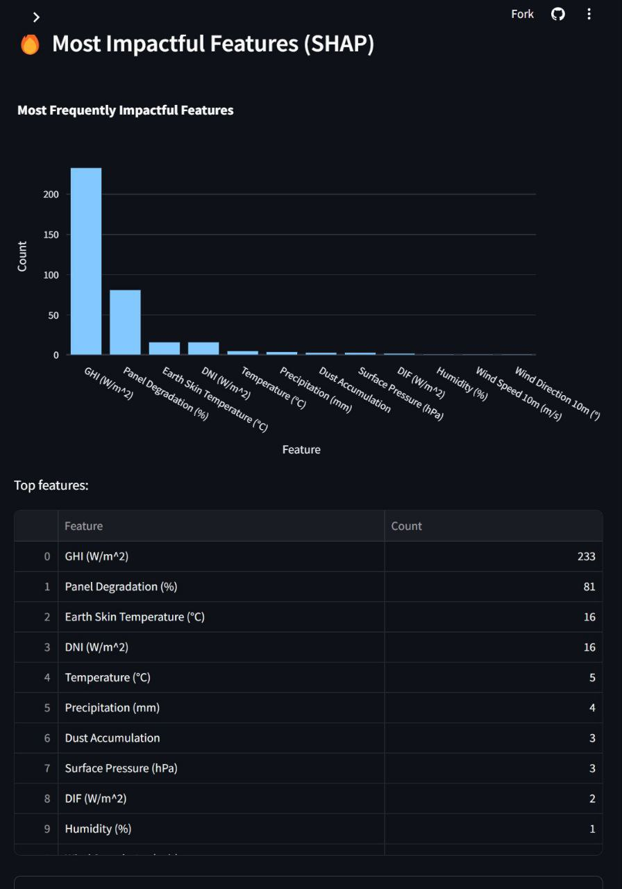
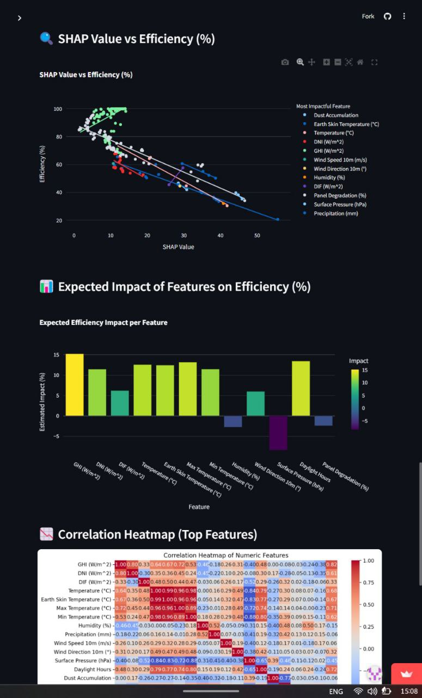

# 🌞 Solar Energy Prediction using Classical and Deep Learning Models

This project presents a comprehensive approach to predicting solar energy (in kWh) using both classical machine learning algorithms and deep learning models. The models are evaluated on accuracy, RMSE, and R² metrics, and are used to forecast solar energy generation for future dates (2025–2027).

## 📁 Files Included

* `predict8.py`: Main script for preprocessing, training, evaluating, and forecasting using multiple ML and DL models.
* `ModelAcc.jpg`: Bar chart comparing the accuracy of all models.
* `RMSE.jpg`: Bar chart showing RMSE and R² scores for each model.

---

## 📊 Model Performance Summary

### ✅ Accuracy Comparison


### 📉 RMSE and R² Comparison



---

## 🧠 Models Used

### Classical Machine Learning:

* Random Forest
* Support Vector Machine (SVM)
* K-Nearest Neighbors (KNN)

### Deep Learning (PyTorch):

* Artificial Neural Network (ANN)
* Convolutional Neural Network (CNN)
* Gated Recurrent Unit (GRU)

### Hybrid Models (Plotted Separately):

* Random Forest + XGBoost
* KMeans + XGBoost
* CNN + XGBoost

---

## 📌 Features Engineered

* **DayOfYear**
* **Month**
* **Year**
* **Standard Scaled Inputs**

---

## 🔧 Key Metrics

| Model                 | Accuracy (%) | RMSE   | R²     | MAE    |
| --------------------- | ------------ | ------ | ------ | ------ |
| Random Forest         | 90.97    | 0.0268 | 0.8210 | 0.0171 |
| SVM                   | 78.00        | 0.0491 | 0.3983 | 0.0416 |
| KNN                   | 89.93        | 0.0279 | 0.8067 | 0.0190 |
| ANN                   | 73.12        | 0.0588 | 0.1372 | 0.0508 |
| CNN                   | 87.20        | 0.0330 | 0.7294 | 0.0242 |
| GRU                   | 79.11        | 0.0458 | 0.4924 | 0.0387 |
| Random Forest-XGBoost | 90.88    | 0.0264 | 0.8268 | 0.0172 |
| KMeans-XGBoost        | 90.34        | 0.0272 | 0.8152 | 0.0183 |
| CNN-XGBoost           | 90.56        | 0.0285 | 0.7983 | 0.0178 |

Metrics are based on test set performance and reflect prediction quality in terms of error and accuracy.

## 🔮 Future Prediction (2025–2027)

The trained models are used to generate daily solar energy forecasts from 2025 to 2027. Results are saved in a CSV file and plotted for visualization.


---

## 🚀 How to Run

1. Clone the repository.
2. Ensure you have the required packages:

   ```bash
   pip install numpy pandas matplotlib scikit-learn torch
   ```
3. Update the dataset path in `predict8.py` if needed.
4. Run the script:

   ```bash
   python predict8.py
   ```

---

## 📈 Output Files

* `model_results_with_accuracy1.csv`: Model performance metrics
* `model_comparison_predictions_2025.csv`: Daily solar predictions (2025–2027)
* `predictions_plot_2025.png`: Plot of predicted energy for all models
* `model_comparison_plot_rmse_r2.png`: RMSE and R² comparison chart

---

## 🧪 Dataset

The dataset used in this project is `solar_energy_test_2024.csv`, which contains historical records of solar energy generation. Each entry includes:

* `Date`: The day of energy measurement.
* `Solar Energy (kWh)`: The total energy generated on that date.

**Feature Engineering:**

* `DayOfYear`: Extracted from the date to capture seasonal trends.
* `Month`: Extracted to account for monthly variation in sunlight.
* `Year`: To capture any long-term trend or changes over years.

These features are standardized using `StandardScaler` before being used for model training.

---


## 🧰 Future Scope

* Integrate real-time weather data
* Use XGBoost and LSTM directly
* Build an interactive web dashboard

---


## 🌞 Solar Energy Efficiency Dashboard

A Streamlit-based interactive dashboard to **analyze**, **visualize**, and **simulate** the efficiency of solar panels using real-world solar sensor data and SHAP-based feature impacts.

---

### 📸 Dashboard Preview

> *Includes live simulation, SHAP impact analysis, and interactive reports.*

---

### 🔧 Features

✅ **Efficiency Over Time Visualization**
✅ **Live Simulation of Solar Efficiency**
✅ **Top Impactful Features (SHAP)**
✅ **SHAP Value vs Efficiency Correlation**
✅ **Expected Feature Impact on Efficiency (%)**
✅ **Correlation Heatmap of Numerical Parameters**
✅ **Low Efficiency Detection with Recommendations**
✅ **Export Filtered Data & Summary Reports**

---

### 🗂️ Project Structure

```
├── predict.py                 # Main Streamlit dashboard code
├── merged_solar_data.csv     # Input dataset (sample solar panel readings)
├── requirements.txt          # Python dependencies
└── README.md                 # GitHub documentation
```

---

### 🚀 Getting Started

#### 1. Clone the repository

```bash
git clone https://github.com/your-username/solar-efficiency-dashboard.git
cd solar-efficiency-dashboard
```

#### 2. Install dependencies

```bash
pip install -r requirements.txt
```

#### 3. Run the Streamlit app

```bash
streamlit run predict.py
```

---

### 🧪 Dataset Overview

The dataset includes:

* `Date`: Timestamp of measurement
* `Efficiency (%)`: Power conversion efficiency of solar cells
* `Most Impactful Feature`: Top SHAP-driven factor affecting efficiency
* `SHAP Value`: Feature attribution value
* `Expected Efficiency Impact (%)`: Model-predicted contribution
* `Recommendation`: Suggested optimization action

You can replace `merged_solar_data.csv` with your own dataset following the same structure.

---

### 📤 Export Options

* **Download Filtered Data (CSV)**
* **Download Summary Report (TXT)**

Available in the "📤 Export" tab of the dashboard.

---

### 📌 Live Simulation

Watch solar efficiency build over time with adjustable simulation speed.

```python
simulate = st.checkbox("▶️ Start Live Simulation")
```

---

### 📷 Screenshots

### Live Efficiency Chart 

### Feature Impacts 

### SHAP Analysis     

   
 
 

---

### 🧑‍💻 Technologies Used

* **Streamlit** – UI and web app framework
* **Pandas** – Data manipulation
* **Plotly** – Interactive plotting
* **Seaborn / Matplotlib** – Correlation plots
* **SHAP** – Model interpretability values (preprocessed)

---

### 🙌 Acknowledgments

Capstone project for **Solar Energy Prediction & Monitoring**, built with 💡 and 📊.

---

